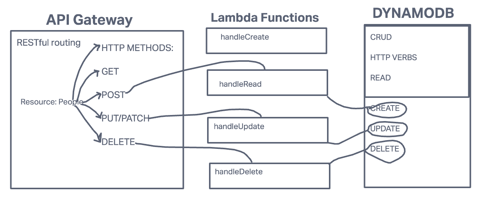

# serverless-api
Lab 18 serverless-api
### Author: Michael Campbell

#### Description: 
Create a **single resource REST API** using a domain model of your choosing, constructed using **AWS Cloud Services**.

Featured tasks:
### Task 1:
- Create one table for one data model at Dynamo DB
### Task 2:
- Create a Dynamoose schema to define the structure of your table
### Task 3:
- Write lambda functions that will separately perform the proper CRUD operation on the database
### Task 4:
- Create your routes using API Gateway
  - Routes should integrate with the appropriate Lambda function to perform the operation

### Setup
Root URL to your API: [Root URL](https://2veauxjvre.execute-api.us-west-2.amazonaws.com)
Routes: 
- /person/add
- /person/delete 
- /person/update
Required inputs: Name ('String') Hobby ('String')
Returned outputs: "Hello, $('User'), are you interested in learning more about $('Hobby')"?
Input is two strings and the output is a string returning the same input.

**Dependencies:**
AWS: API, Dynamo and Lambda

#### UML
(created with [invisionApp](https://invisionapp.com/) )

